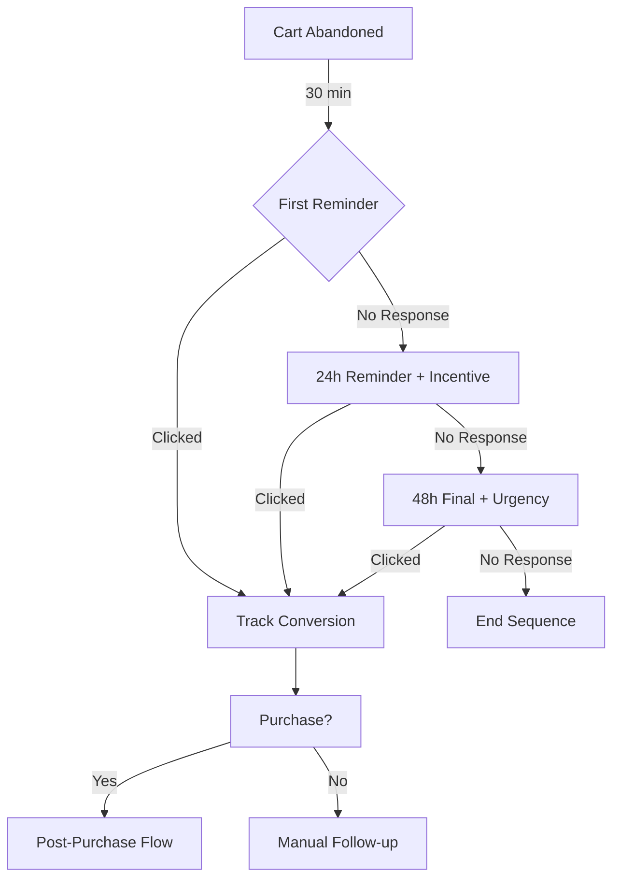
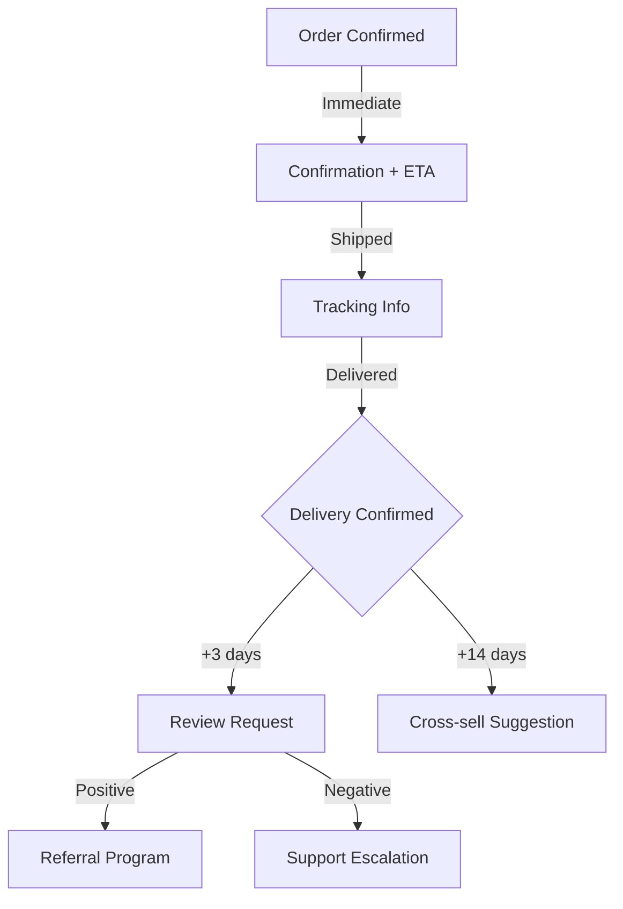
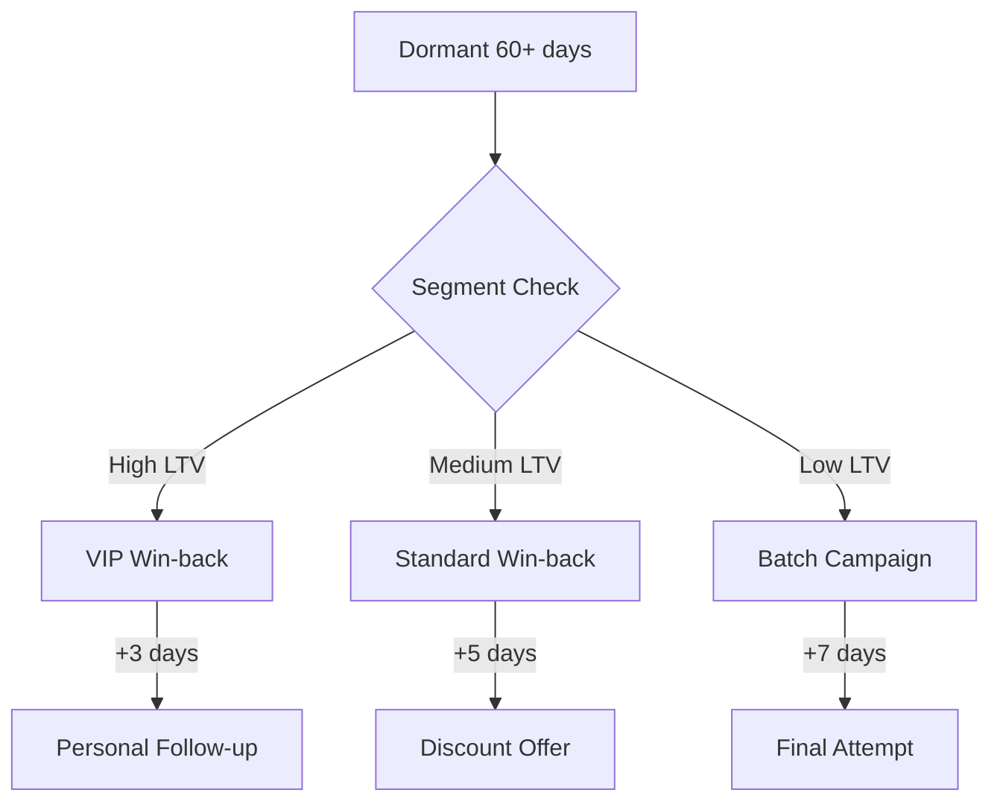

<div align="center">
  <strong>φ</strong>
  <h1>WhatsApp CRM Flows</h1>
  <p><em>Ready-to-use WhatsApp CRM flow templates for e-commerce automation</em></p>
  <p>
    <a href="https://github.com/elidadutra187/whatsapp-crm-flows">Repository</a> ·
    <a href="https://github.com/elidadutra187">GitHub Profile</a>
  </p>
</div>


## Positioning

This repository is part of the `φ` portfolio by [Élida Dutra](https://github.com/elidadutra187), focused on practical systems for e-commerce, automation, analytics, content generation and growth operations.

**Repository:** [elidadutra187/whatsapp-crm-flows](https://github.com/elidadutra187/whatsapp-crm-flows)  
**GitHub:** [https://github.com/elidadutra187](https://github.com/elidadutra187)  
**Purpose:** Ready-to-use WhatsApp CRM flow templates for e-commerce automation


> Ready-to-use WhatsApp CRM flow templates for e-commerce automation

## Overview

WhatsApp CRM Flows provides a collection of battle-tested messaging flow templates for e-commerce businesses using WhatsApp Business API. Each flow includes Mermaid diagrams, message templates, timing recommendations, and integration guidelines.

These flows have been refined through real-world usage, processing thousands of customer interactions. The templates are platform-agnostic and can be implemented in any WhatsApp automation tool (n8n, Make, Zapier, custom code).

## Stack

- **Documentation:** Markdown + Mermaid diagrams
- **Templates:** WhatsApp-compatible message formats
- **Integration:** Platform-agnostic (works with any automation tool)

## Features

- **Abandoned Cart Recovery:** Multi-touch recovery sequence
- **Post-Purchase Follow-up:** Order confirmation and review requests
- **Win-Back Campaigns:** Re-engagement for dormant customers
- **Support Escalation:** Automated triage with human handoff
- **Order Updates:** Shipping and delivery notifications

## Flow Templates

### 1. Abandoned Cart Recovery



**Timing:**
- T+30min: Soft reminder with cart link
- T+24h: Add small incentive (free shipping, 5% off)
- T+48h: Final message with urgency/scarcity

**Key Metrics:**
- Open Rate: 85-95%
- Click Rate: 25-35%
- Recovery Rate: 8-15%

### 2. Post-Purchase Sequence



### 3. Win-Back Campaign



## Message Templates

### Abandoned Cart - First Touch

```
Oi {{customer_name}}! 👋

Vi que você deixou alguns itens no carrinho:

{{product_list}}

Seu carrinho expira em 24h. Posso ajudar com alguma dúvida?

👉 Finalizar compra: {{cart_link}}
```

### Order Confirmation

```
✅ Pedido confirmado, {{customer_name}}!

📦 Pedido: #{{order_id}}
💰 Total: R$ {{total}}

Prazo de entrega: {{delivery_estimate}}

Você receberá o código de rastreio assim que o pedido for enviado.

Obrigado pela confiança! 💚
```

### Review Request

```
Oi {{customer_name}}!

Seu pedido foi entregue há alguns dias. Tudo chegou certinho?

Sua opinião é muito importante pra gente! Poderia avaliar sua experiência?

⭐ Avaliar: {{review_link}}

Obrigado! 🙏
```

## Quick Start

1. **Choose your automation platform** (n8n, Make, Zapier, custom)
2. **Copy the flow diagram** to visualize the logic
3. **Adapt message templates** to your brand voice
4. **Set up triggers** based on your e-commerce events
5. **Configure timing** according to your customer behavior

## Project Structure

```
whatsapp-crm-flows/
├── flows/
│   ├── abandoned-cart.md       # Recovery flow
│   ├── post-purchase.md        # Follow-up sequence
│   ├── win-back.md             # Re-engagement
│   ├── support-triage.md       # Support escalation
│   └── order-updates.md        # Shipping notifications
├── templates/
│   ├── messages-pt-BR.md       # Portuguese templates
│   └── messages-en.md          # English templates
├── integrations/
│   ├── n8n-examples.md         # n8n workflow examples
│   └── api-endpoints.md        # Webhook structures
├── README.md
└── LICENSE
```

## Best Practices

### Timing

| Flow | First Touch | Follow-up | Final |
|------|-------------|-----------|-------|
| Abandoned Cart | 30 min | 24h | 48h |
| Post-Purchase | Immediate | +3 days | +14 days |
| Win-Back | 60 days dormant | +3-5 days | +7 days |

### Opt-Out Handling

Always include:
- Clear opt-out option in every message
- Immediate unsubscribe processing
- Opt-out confirmation message

### Personalization

Required variables:
- `{{customer_name}}` - First name
- `{{product_list}}` - Formatted product list
- `{{cart_link}}` / `{{order_link}}` - Direct links

## Metrics Benchmarks

| Metric | Good | Excellent |
|--------|------|-----------|
| Open Rate | > 80% | > 90% |
| Click Rate | > 20% | > 30% |
| Cart Recovery | > 8% | > 15% |
| Review Response | > 15% | > 25% |

## Use Cases

- **E-commerce:** Cart recovery, order updates, reviews
- **Subscription:** Renewal reminders, cancellation prevention
- **Marketplace:** Seller notifications, buyer follow-up
- **Services:** Appointment reminders, feedback collection

## Roadmap

- [ ] WhatsApp Flows (interactive buttons) templates
- [ ] AI-powered response suggestions
- [ ] A/B testing framework
- [ ] Analytics dashboard template

## Author

**Élida Dutra**
Growth Engineer | E-commerce | AI Marketing Automation

[](https://www.linkedin.com/in/elidadutra)
[](https://github.com/elidadutra)

## License

MIT

---

<p align="center">
  <strong>φ</strong><br>
  <em>Building intelligent systems at the intersection of marketing, data, and AI</em>
</p>

<div align="center">
  <strong>φ</strong>
  <br />
  <sub>Built and maintained by <a href="https://github.com/elidadutra187">Élida Dutra</a>.</sub>
</div>

