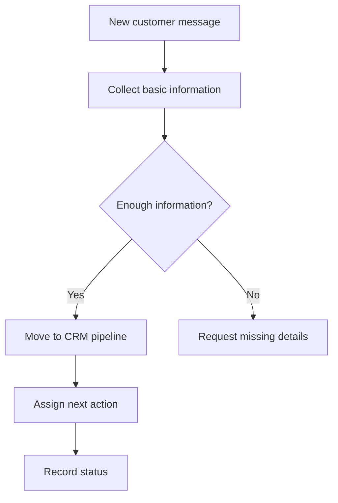

# WhatsApp CRM Flows

**Documentation templates for WhatsApp-based CRM routines, lead qualification, customer support and e-commerce communication.**

This repository organizes customer communication flows for businesses that use WhatsApp as a service and sales support channel.

Repository: [elidadutra187/whatsapp-crm-flows](https://github.com/elidadutra187/whatsapp-crm-flows)

---

## Business problem

Many businesses receive customer requests through WhatsApp but do not have a clear process for collecting information, updating CRM stages and keeping service history organized.

The goal of this project is to document simple CRM flows that help teams ask better questions, reduce duplicated work and keep customer interactions easier to track.

---

## What it does

The repository provides reusable documentation for:

- first contact structure;
- lead qualification questions;
- customer information collection;
- budget or quote request flow;
- support triage;
- post-purchase check-in;
- CRM pipeline organization;
- human handoff rules.

---

## Stack and format

- **WhatsApp Business** for customer communication
- **CRM logic** for pipeline organization
- **n8n or similar tools** for implementation when needed
- **Mermaid diagrams** for flow visualization
- **Markdown** for documentation
- **Webhooks / APIs** for system connections

---

## Example flow

---

## Why it matters

WhatsApp is often treated as a simple chat channel, but in many businesses it is also a commercial and service interface.

A structured flow helps the team:

- collect the right information early;
- reduce repeated questions;
- organize customer requests;
- keep CRM stages updated;
- improve service continuity;
- make customer communication easier to review.

---

## Use cases

- E-commerce customer service
- Local businesses receiving quote requests
- Service businesses using WhatsApp for support
- CRM teams that need organized customer history
- Marketing operations teams building customer journeys

---

## Expected impact

- Better lead organization
- Clearer service process
- Fewer lost conversations
- Better CRM visibility
- More consistent customer communication

---

## Status

Portfolio case / flow library.

This project represents practical work in **CRM, WhatsApp communication and commercial operations**, especially for businesses where customer conversations are part of the sales process.

---

## Author

**Élida Dutra**  
Growth · CRM · E-commerce Ops · WhatsApp Business · Marketing Operations

[LinkedIn](https://www.linkedin.com/in/elidadutra) · [GitHub](https://github.com/elidadutra187)
