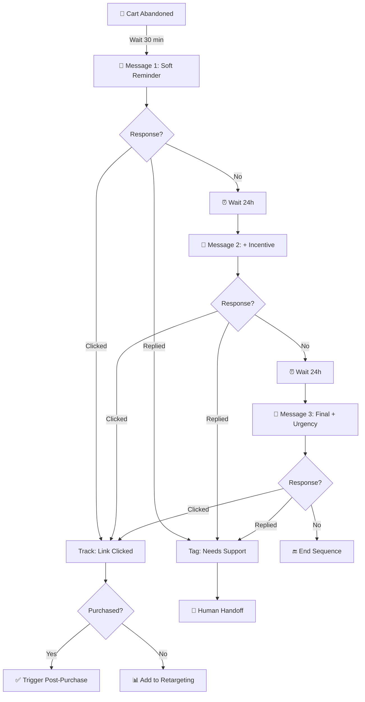

# Abandoned Cart Recovery Flow

## Overview

Multi-touch sequence to recover abandoned shopping carts via WhatsApp.

## Flow Diagram



## Trigger

- Event: `cart.abandoned`
- Conditions:
  - Cart value > R$ 50
  - Customer has WhatsApp opt-in
  - Not in active support ticket
  - Not purchased in last 2 hours

## Messages

### Message 1: Soft Reminder (T+30min)

```
Oi {{customer_name}}! 👋

Notei que você deixou alguns itens no carrinho:

{{product_list}}

Ficou com alguma dúvida? Posso te ajudar!

👉 {{cart_link}}
```

**Variables:**
- `customer_name`: First name from CRM
- `product_list`: Top 3 products, formatted
- `cart_link`: UTM-tracked cart recovery link

### Message 2: Incentive (T+24h)

```
{{customer_name}}, seus itens ainda estão esperando! 🛍️

Para facilitar, estou te dando FRETE GRÁTIS pra finalizar o pedido.

Use o cupom: VOLTEI

⏰ Válido por 24 horas

👉 {{cart_link}}
```

**Notes:**
- Only send if cart still exists
- Validate coupon availability before sending
- Track coupon usage for attribution

### Message 3: Urgency (T+48h)

```
Último aviso, {{customer_name}}! ⚠️

Seu carrinho será limpo em algumas horas:

{{product_list}}

Não perca a chance!

👉 {{cart_link}}
```

## Exit Conditions

Stop sequence immediately if:
- Customer completes purchase
- Customer unsubscribes
- Customer replies with negative sentiment
- Cart is emptied/expired

## Integration Points

### Webhook: Cart Abandoned
```json
{
  "event": "cart.abandoned",
  "customer": {
    "id": "cust_123",
    "phone": "+5511999999999",
    "name": "João"
  },
  "cart": {
    "id": "cart_456",
    "total": 299.90,
    "items": [
      {"name": "Camiseta Premium", "price": 129.90, "qty": 1},
      {"name": "Calça Jeans", "price": 169.90, "qty": 1}
    ],
    "recovery_url": "https://store.com/cart/recover/abc123"
  }
}
```

### Webhook: Link Clicked
```json
{
  "event": "link.clicked",
  "customer_id": "cust_123",
  "cart_id": "cart_456",
  "message_number": 1,
  "timestamp": "2026-05-27T14:30:00Z"
}
```

## Metrics

| Metric | Target | Calculation |
|--------|--------|-------------|
| Delivery Rate | > 95% | Delivered / Sent |
| Open Rate | > 85% | Read / Delivered |
| Click Rate | > 25% | Clicked / Delivered |
| Recovery Rate | > 10% | Purchased / Abandoned |
| Revenue Recovered | Track | Sum of recovered orders |

## A/B Test Ideas

- Timing: 30min vs 1h vs 2h for first touch
- Incentive: Free shipping vs % discount vs fixed amount
- Urgency: Real scarcity vs artificial urgency
- Tone: Formal vs casual vs emoji-heavy
